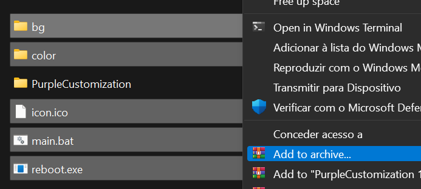
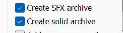
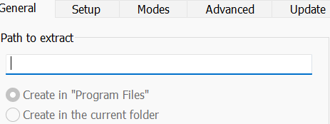

# PurpleCustomization
My customization tool
Coded in Cpp, Batch.
                  
                  It's your responsability if you insert a malware on it recommended download by the github in release
                  
# How to make it be a exe
Download WinRAR 
Now make a sfx file and a exe, by modding some options (Press add to archive after selecting some files)

  

After clicking on it, mark these 2 options

  

Go to Advanced
SFX Options

  

                                                 
Change the path OPTIONAL (Need to change the source code too) The Normal is C:\Windows\Locate\

Now, Go to setup and insert main.bat

In modes, let it as Hide all

Advanced > Request admin perms

Update > No change

Text and icon > The 2 options below, let it with the icon.ico

Done! Now press OK and OK Again

# GIF Showing the Aplicaton (RB 11)

  

                                                 
